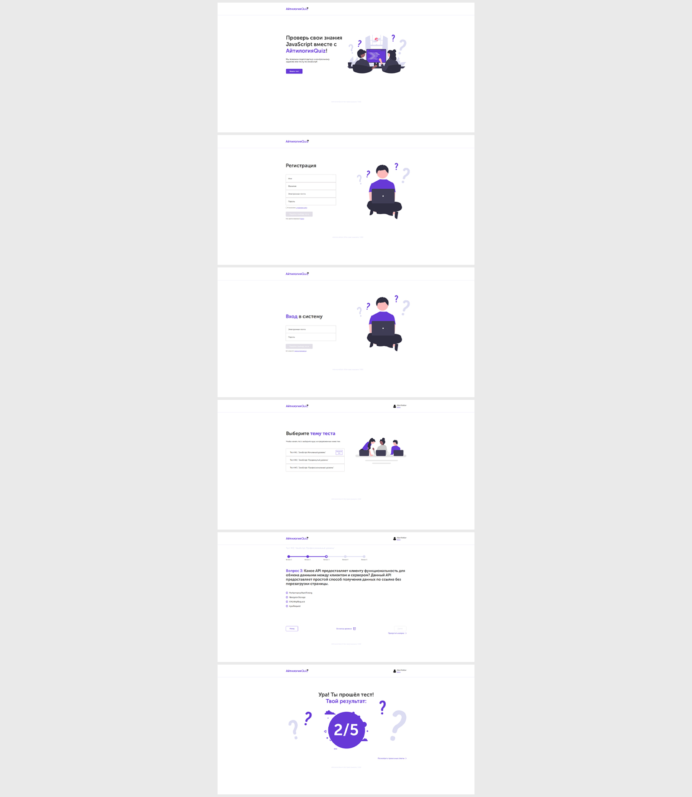

# Веб-приложение quiz-викторина (JavaScript)

Проект выполнен в рамках обучения на курсе "Профессия Frontend-Разработчик" в онлайн-школе "Айтилогия".

## Внешний вид

## Выполненные задачи:
- Реализация frontend-части SPA в соответствии с техническим заданием и макетов;
- Практика использования чистого JavaScript для реализации SPA (использование компонентов, сервисов, роутинг, запросы, шаблоны);
- Практика использования Webpack для сборки проекта, копирования нужных файлов;

## Используемые технологии:
* HTML
* CSS
* JavaScript
* WebPack
* JWT-Авторизация
* Используется заранее подготовленный backend на node.js